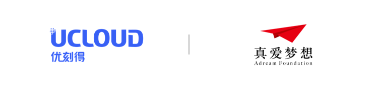
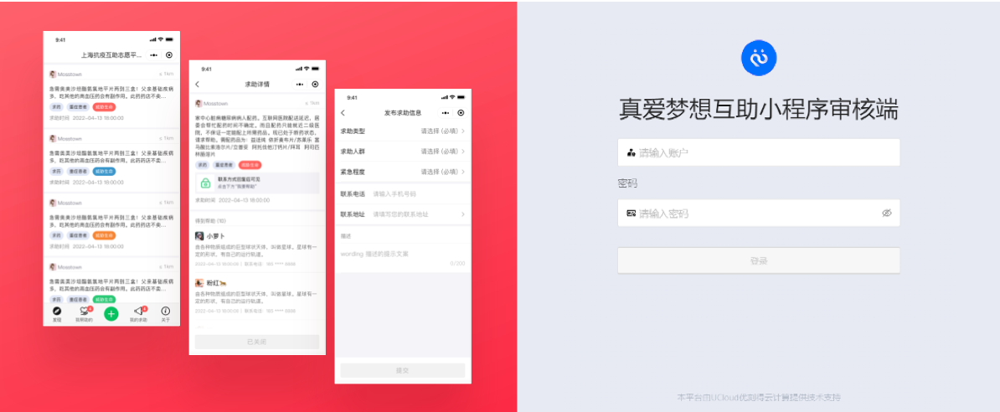

#  开源社区互助微信小程序

本开源社区互助微信小程序（原名：沪帮互助），是在上海疫情期间，一款面向社区居民简单生活需求，倡导通过线上发起求助，线下无接触提供帮助，促成社区居民在疫情期间快速、高效地形成社区内日常生活问题自救的移动端平台。

小程序从2022年4月13日开始开发，主要基于真爱梦想基金会“爱沪有我”项目在社会帮扶、城市救助方面深厚的实践和经验，借由UCloud优刻得技术团队实现开发上线。随着上海疫情趋于稳定，我们决定将改项目开源，用于帮助更多有需要的人。

# 主要功能

小程序经历了两版迭代，主要实现的功能：

1. 平台通过LBS技术，实现对生活区300~1000米范围内的用户发出求助信息;
2. 收到求助信息的用户，如能够提供帮助，可以回复求助信息，并留下联系方式，和查看求助者的联系方式，形成小区内求助和帮助的撮合。
3. 用户在“收到帮助”或“提供的帮助被采纳”时，可以收到服务提醒;
4. 小程序支持求助信息的转发，以获得更多人的关注，提高获得帮助的可能性；
5. 配置了求助信息的内容审核端，确保无效求助信息的过滤。

# 配置与部署
[1. 后端部署说明](https://github.com/ucloud/mutualaid/tree/master/backend#readme)

[2. 前端部署说明](https://github.com/ucloud/mutualaid/tree/master/frontend#readme)

[3. 微信小程序报备审核](https://developers.weixin.qq.com/community/operate/doc/00002a6a0b8d98a965993666a51001)

# 开发者与协议
开发团队：[UCloud优刻得](https://www.ucloud.cn/)、 [真爱梦想基金会](https://www.adream.org/)

开源协议：[MIT](https://opensource.org/licenses/MIT)
