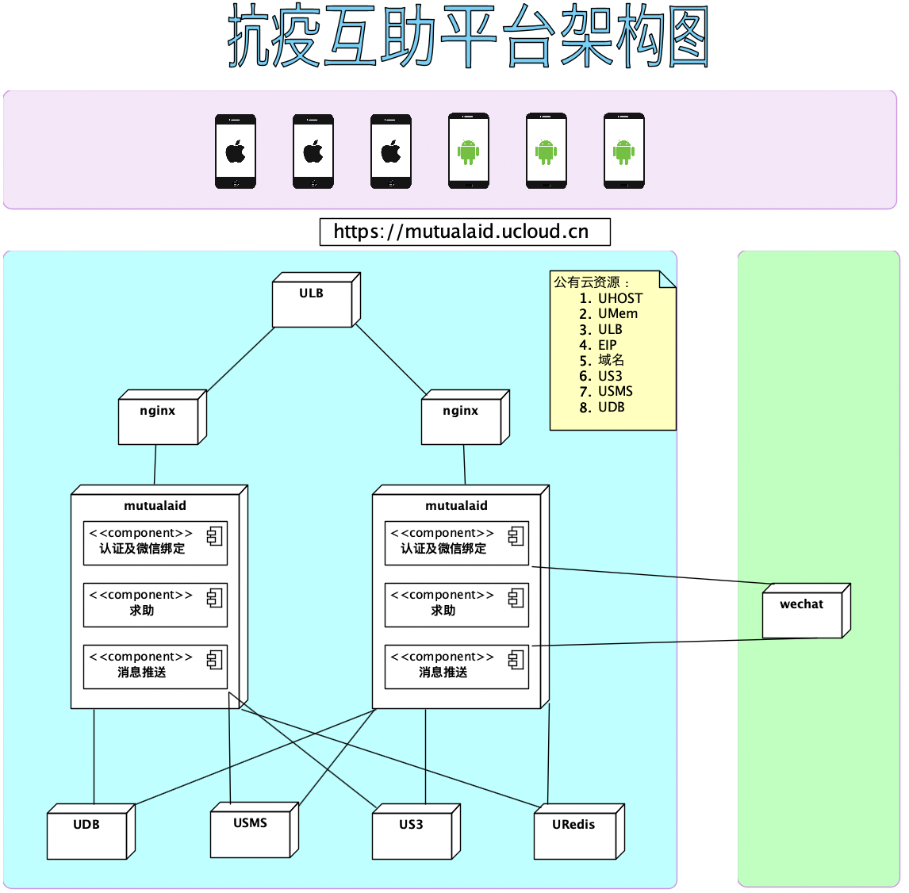

# 项目简介

本项目是真爱基金互助小程序发现、求助、帮助等功能的服务端项目。
该项目使用了 [kratos][1] 微服务框架进行开发。 本项目运用 protobuf
接口描述语言定义对外提供的服务接口和数据模型， 提供 HTTP 和 gRPC
协议的微服务接口。 此外，protobuf 还被运用于错误码定义和调用内部网关 API 接口。
本项目还使用了编译时依赖注入技术，通过构造函数注入，降低编写复杂的应用初始化代码的难度。

## 业务功能

### 用户角色

- 求助者
- 救助者

### 功能列表

| 模块  | 功能点       | 角色        | 说明  |
|-----|-----------|-----------|-----|
| 用户  | 绑定微信登入    | 求助者 / 救助者 |     |
|     | 发现        | 求助者 / 救助者 |     |
|     | 我的帮助      | 求助者 / 救助者 |     |
|     | 求助        | 求助者       |     |
|     | 撤销求助      | 求助者       |     |
|     | 完成求助      | 求助者       |     |
|     | 我的求助      | 求助者 / 救助者 |     |
|     | 帮助 / 求助详情 | 求助者 / 救助者 |     |
|     | 帮助        | 救助者       |     |

## 系统架构

本项目参考了 DDD 架构分层思路，将应用内部组织为单向依赖的四层结构：

- 服务及事件层
- 业务层
- 数据聚合及微服务访问代理层
- 数据访层

  以下是本项目的系统架构图：

本项目的依赖中间件如下：

- MySQL
- Redis （集群模式）

本项目使用 MySQL 存储居民、居委、订单相关信息。并使用了 [gorm][2] 简化数据访问层代码。

## 开发指南

### 安装命令行工具

请执行以下命令安装本项目所需的 kratos 和 google wire 命令行工具：

go get -u github.com/go-kratos/kratos/cmd/kratos/v2@latest 

go get github.com/google/wire/cmd/wire

### 生成 gRPC 服务客户端和服务端代码

每当我们更新 `api/mutualaid/mutualaid.proto` 文件时，我们需要使用代码生成工具生成客户端。 当我们增加服务或方法时，还需要生成服务端代码。 我们可以利用 kratos 命令行工具帮助我们实现这个目标。 生成
gRPC 客户端代码，请执行以下命令：

cd <path-to-mutualaid-top-level-dir>
make api 生成 gRPC 服务端代码，请执行以下命令：

cd <path-to-mutualaid-top-level-dir>
kratos proto server api/server/server.proto -t internal/service

### 生成 mutualaid 错误码

每当我们在`api/mutualaid/uerrors/error_reason.proto`文件中定义一个新的错误码后， 我们需要用 kratos 命令新生成代码，请执行以下命令：

cd <path-to-mutualaid-top-level-dir>
make errors

### 生成依赖注入代码

每当我们引入新的依赖时，我们需要使用 wire 命令生成`cmd/mutualaid/wire_gen.go`。 以下是命令行示例：

cd <path-to-mutualaid-top-level-dir>
cd cmd/mutualaid
[wire][4]

### 生成库表 [gorm][2] 的`model`代码

每当我们库表有变动时，我们需要使用 kratos 命令重新生成`internal/data/model`中的代码。
生成 model 代码，请执行以下命令：

cd <path-to-mutualaid-top-level-dir>
kratos run cmd/gen

## 部署

本项目的生产环境使用 UCloud 云主机部署。
本项目实现了自动部署应用及其依赖的运行环境。

本项目的部署依赖的中间件有：

- MySQL
- Redis （集群模式）

本项目的部署依赖的服务有：

- wechat（微信支付）
- ucloud (UCloud 云服务）
  - ufile（对象存储服务）
  - usms（通知服务）

执行 mutualaid 部署之前，请确保以上中间件和微服务已经部署完毕并处于正常的服状态。默认编译输出的可执行程序执行环境与Docker镜像均基为Linux\amd64，如需要调整请修改Makefile。

### 测试
MySQL schema/schema.sql 使用此文件创建数据库
Redis 本地测试环境可参考https://redis.io/docs/manual/scaling/#creating-a-redis-cluster-using-the-create-cluster-script，使用官方脚本启动集群模式

[1]: https://go-kratos.dev
[2]: https://gorm.io/index.html
[3]: https://github.com/go-gorm/gen
[4]: https://github.com/google/wire
[5]: https://kun.ucloudadmin.com/instrument/ip
[6]: https://github.com/ucloud/mutualaid/backend/-/pipelines

